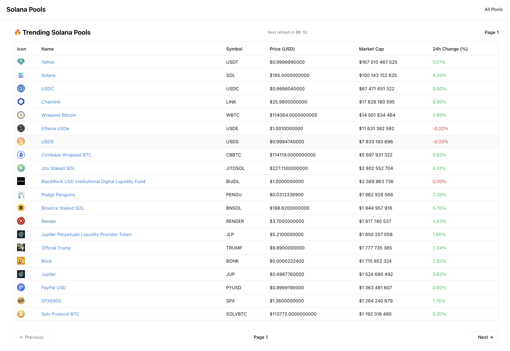
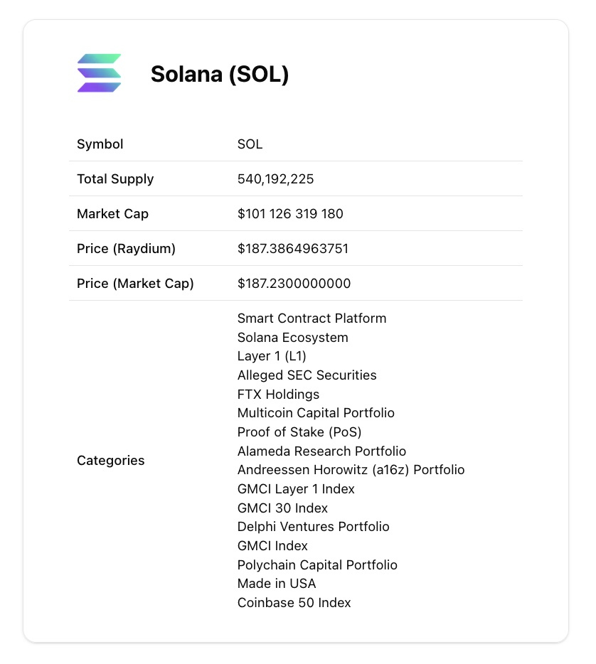

# Solana Pools — Next.js + shadcn/ui




A tiny app built with **Next.js (App Router)** and **shadcn/ui** that shows trending **Solana** pools and a dynamic **Token Pool** page.

---

## Features

- **Trending Solana pools** from CoinGecko (≥ 20 rows)
- **Token Pool page** with:
  - name, symbol, image, **total supply** (via Solana RPC)
  - **price & market cap** (via Raydium API — see https://api-v3.raydium.io/docs/)
- **Auto-refresh every 60s** (home & token pages)
- **Pagination** on the home page
- **Visible 60s countdown timer** on the home page
- Accessible UI with **shadcn/ui Data Table**
- Type-safe with **TypeScript**

---

## Data Fetching & Architecture

- **Home page (trending list):** classic **client-side fetch** using `axios` in a client component.
- **Token page (details):** uses **SWR** (stale-while-revalidate) with a `refreshInterval` of 60s to keep data fresh.
- **API proxying:** all frontend calls go through **internal Next.js API routes** (`/api/*`).  
  External requests (CoinGecko, Raydium, Solana RPC) are made **server-side** to keep API keys in environment variables and **avoid exposing `NEXT_PUBLIC_*` keys** in the browser.

---

## Quick Start

```bash
# 1) Install deps
npm i
# or: yarn / pnpm / bun

# 2) Run dev server
npm run dev

# 3) Open the app
http://localhost:3000
